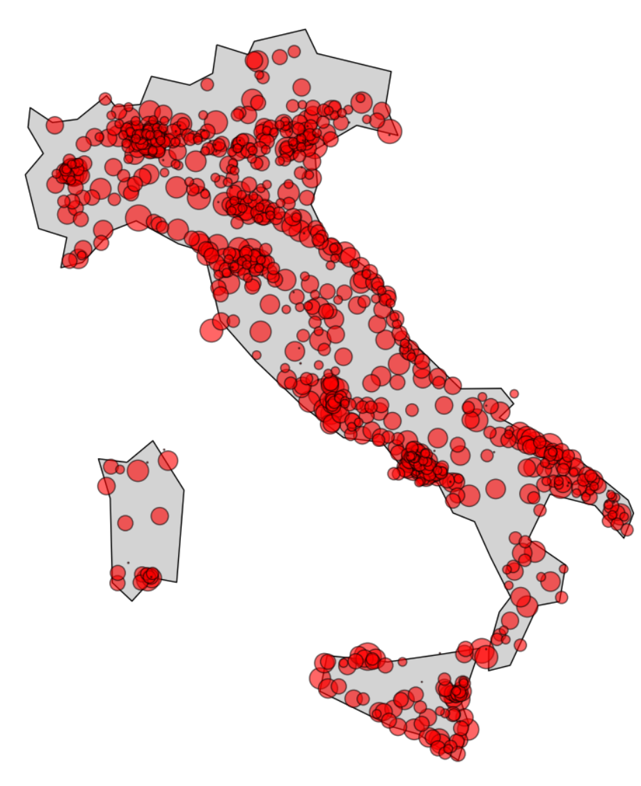

# Italian Credit Card Transactions Dataset

This dataset is provided for participants in the Nexi Hackathon to complete the development and testing of expense-tracking applications.

## 📁 File

**Filename:** `italian_credit_card_transactions.csv`  
**Shape:** `(1,296,675 rows × 11 columns)`  
**Total Elements:** `14,263,425`

---

## 📊 Data Overview

This dataset contains anonymized credit card transaction records from **2019 to 2020**. It includes customer demographic data and transaction-level details useful for building databases, APIs, dashboards, and performing analysis.

---

## 📌 Column Descriptions

| Column       | Description                              |
|--------------|------------------------------------------|
| `trans_num`  | Unique identifier for the transaction    |
| `amount`     | Transaction amount (in EUR)              |
| `trans_date` | Date of the transaction                  |
| `trans_time` | Time of the transaction                  |
| `category`   | Purchase category (14 unique values)     |
| `first`      | Customer first name                      |
| `last`       | Customer last name                       |
| `gender`     | Customer gender (`F` or `M`)             |
| `dob`        | Date of birth                            |
| `city`       | City of residence                        |
| `job`        | Category of occupation (30 unique values)|

---

## 👥 DB Insights

- **Total unique individuals:** `983`  
  (based on combination of first name, last name, and date of birth)
- **Unique jobs:** `30`
- **Birth years:** `81` distinct years (from 1924 to 2004)
- **Gender distribution:**
  - Female: `54.74%`
  - Male: `45.26%`
- **Unique categories of purchase** '14'

---

## 🖼 Sample Preview

Here’s a preview of the first five rows of the dataset:

